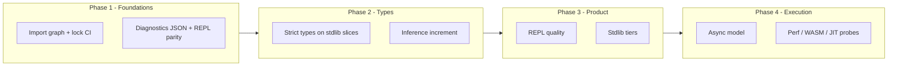

# Kern language evolution roadmap

This document is a **designer-level plan**: priorities, trade-offs, phased steps, and example sketches. It assumes familiarity with `docs/GETTING_STARTED.md` and `config/feature_flags.json`.

For a **production-oriented ordering** of the same themes (stability → diagnostics → language surface → performance → stdlib/OS → tooling), see [PRODUCTION_VISION.md](PRODUCTION_VISION.md).

---

## 1. Where Kern stands today (baseline)

| Area | Current state (repo) |
|------|------------------------|
| **Execution** | Bytecode VM (`src/vm/`), compile-run path in `src/main.cpp` (`runSource`). |
| **Modules** | Runtime `import("...")` via `__import` (`src/import_resolution.*`); `kern.json` / lockfile for deps; `KERN_LIB` for stdlib roots. Not a full static graph with sealed namespaces at compile time. |
| **Diagnostics** | Structured reporter (`src/errors.*`), categories, JSON mode for `--check`, runtime errors with **call stack slice** (`VMError` + `getCallStackSlice()`). |
| **Types** | Dynamic core; **preview** semantic / strict paths (`--check --strict-types`, `semantic_engine_v1`, `typed_ir_pipeline` in feature flags). |
| **Tooling** | `kern --check`, `--fmt`, `--ast`, `--bytecode`, `--scan`, `kern test` (with filter/list/fail-fast), REPL in `main.cpp`, separate `repl/repl_main.cpp`, `kern doctor`. |
| **Memory** | VM-managed values; no user-facing GC API documented as a language feature (implementation detail today). |
| **Concurrency** | No first-class async/await or threads in the core language (FFI/OS may exist for platform glue). |

Use this baseline to avoid duplicating work: **extend** pipelines (semantic, IR, scanner) rather than inventing parallel systems.

---

## 2. Guiding principles

1. **Progressive disclosure**: untyped scripts stay easy; types and stricter checks are opt-in per file or flag.
2. **One diagnostic story**: every path (REPL, CLI, IDE, CI) should converge on the same error model (codes, spans, JSON).
3. **Package reality**: resolve paths and versions **before** fancy syntax; `kern.json` + lockfile are the spine.
4. **No second parser**: new syntax feeds the same lexer/parser with clear grammar versioning if needed.
5. **Complexity budget**: each release ships **one** major vertical (e.g. “typed surfaces” OR “async model”), not five half-finished ones.

---

## 3. Roadmap (prioritized by impact × feasibility)

### Tier A — Highest impact / foundation

| Priority | Theme | Why it matters |
|----------|--------|----------------|
| **A1** | **Module & package graph** | Scales code organization, caching, IDE, and reproducible builds. |
| **A2** | **Diagnostics v2** (spans, stability, REPL parity) | Daily ergonomics; competitive with JS/Rust UX. |
| **A3** | **Gradual typing** (reuse semantic engine + flags) | Safety without Python’s “no types” or Rust’s “all in”. |

### Tier B — Strong differentiators

| Priority | Theme | Why it matters |
|----------|--------|----------------|
| **B1** | **Standard library tiers** (`std` v1, `std/os`, etc.) | Real programs need batteries; keep namespaces clear. |
| **B2** | **REPL + debugger story** (breakpoints, inspect, last error) | Learning and incident response. |

### Tier C — Execution model (later)

| Priority | Theme | Notes |
|----------|--------|--------|
| **C1** | **Async / concurrency** | Requires event loop + cancellation semantics; high design cost. |
| **C2** | **Memory model docs + optional caps** | Clarify VM ownership; optional arena/RC only if measured need. |
| **C3** | **Performance** (JIT, AOT previews) | After IR and types stabilize; `wasm_backend_preview` is a probe. |

---

## 4. Feature designs (condensed)

### A1 — Robust module / package system

**Goal:** Clean imports, deterministic resolution, dependency closure, CI-friendly.

**Design:**

- **Layers:** (1) **Physical**: map import string → file path under `KERN_LIB` / project root. (2) **Logical**: package name + version from `kern.json` / lockfile. (3) **Optional**: explicit export lists (see below).
- **Syntax evolution (optional, backward compatible):** keep `import("path")` forever; add sugar only when the graph is solid, e.g. `import "math"` as desugaring to documented rules.
- **Export control:** start with **file = module** (one `.kn` = one module object); later `export function foo` if the parser gains export lists without breaking old files.

**Phased implementation:**

1. **Import graph tool** (partially aligned with `import_graph_v1`): static listing of `import(` calls + resolved paths; `kern --scan` integration.
2. **Duplicate load cache**: same canonical path → one evaluation per VM/process where safe.
3. **Version pins**: enforce `kern.lock` in CI mode (`kern test` / `--check` flag).
4. **Namespace sugar**: only after (1)–(3) are stable.

**Example (current + aspirational):**

```kn
// Today — explicit, works everywhere
let m = import("lib/kern/math/vec.kn")

// Future (illustrative; not implemented until specified)
// import vec from "lib/kern/math/vec.kn"
```

---

### A2 — Error handling & diagnostics v2

**Goal:** Readable errors, stable codes, optional stack traces, REPL matches CLI.

**Design:**

- **Unify** compile-time and runtime reporting (already centered on `g_errorReporter`); ensure REPL uses the same paths and **source filename** (`<repl>` vs file).
- **Stack traces:** VM already provides frames; add **optional** source snippets (line ± N) when filename + source map exist.
- **“Typed errors”:** later: attach a small **tag** string or numeric code in `throw` payload (VM + convention); do **not** require full type system for v1.

**Phased implementation:**

1. Document error codes in one table (`docs/` or generated from `errors.cpp`).
2. REPL: on failure, print **last error** + suggestion to run with `KERN_VM_TRACE=1` (already in `kern doctor`).
3. Optional `--trace` CLI flag to enable VM trace for one script run (env today; flag is UX).
4. JSON diagnostics: extend schema with `stack: [{file, line, fn}]` where available.

**Example:**

```kn
function f() { g() }
function g() { throw("bad") }
f()
// Future: throw tagged — e.g. throw({ tag: "IO", message: "..." })
```

---

### A3 — Type system (gradual / hybrid)

**Goal:** Optional annotations, inference where cheap, `--strict-types` becomes production-viable.

**Design:**

- **Python + mypy model:** default dynamic; annotations improve checking when enabled.
- **Surface:** function params/returns and `let x: T` only if grammar stays consistent with Kern’s `let`.
- **Implementation:** drive from existing **semantic engine** + `typed_ir_pipeline` (feature flags); no duplicate typechecker.

**Phased implementation:**

1. Stabilize **strict-types** on real projects (stdlib snippets + tests).
2. Narrow, well-defined **typed builtins** table (append-only policy per `CONTRIBUTING.md`).
3. Inference for locals from literals and return statements (incremental).
4. Language-server alignment: same diagnostics as `kern --check --json`.

**Example (illustrative):**

```kn
// Aspirational syntax — must be validated against parser
function add(a: number, b: number): number {
  return a + b
}
```

---

### B1 — Standard library expansion

**Goal:** Practical utilities without dumping a flat global namespace.

**Design:**

- **Tiered modules:** `std` core (strings, lists, math helpers), `std/fs`, `std/json` (already patterns exist), platform behind flags.
- **Stability:** version `stdlib` like `STDLIB_STD_V1` docs; breaking changes = new tier or new import path.
- **Implementation:** prefer `.kn` in `lib/kern/stdlib/` + thin builtins where performance requires native code.

---

### B2 — REPL & debugging

**Goal:** Fast feedback, inspect state, repeat last failure.

**Design:**

- Commands: `:print <expr>`, `:file <path>` (run in file context), **`:trace on/off`** (wraps VM trace).
- Share **one** evaluation function with CLI so behavior matches.

**Phased implementation:**

1. REPL help lists env vars and flags (`KERN_VM_TRACE`, `--ffi`).
2. Optional readline/history file (platform-dependent).
3. Breakpoints require VM hooks — **late** phase.

---

### C1 — Concurrency / async

**Goal:** Modern I/O without nested callback hell.

**Design options (pick one later):**

- **Async/await** with explicit event loop (like JS) — fits embedding.
- **Structured concurrency** (tasks + cancel) — safer but more runtime work.

**Dependency:** clear **memory and error** story for cross-task sharing.

**Example (illustrative only):**

```kn
// Not implemented — design sketch
// let data = await fetch(url)
```

---

### C2 — Memory management (language-visible)

**Today:** treat as VM implementation detail; document **value semantics** (copy vs ref for tables) in user docs.

**Future:** only if profiling demands: optional **arena** for batch workloads, or weak refs for caches — **after** module and type stories.

---

## 5. Suggested release sequencing



- **Phase 1 (next):** A1 steps 1–2 + A2 steps 1–2.
- **Phase 2:** A3 phases 1–2.
- **Phase 3:** B1 + B2.
- **Phase 4:** C1/C2/C3 as needs justify.

---

## 6. Anti-goals (avoid bloat)

- A second import syntax **without** a working static graph.
- Full Rust-style borrow checker **before** gradual typing pays off.
- User-facing GC knobs **without** measured allocation problems.
- Async **before** errors and modules feel solid.

---

## 7. How to use this document

- **Contributors:** pick a **single** Phase 1 item; open a design PR referencing this file.
- **Maintainers:** align `feature_flags.json` tier moves (preview → stable) with phases above.
- **Revision:** append dated sections; do not rewrite history — migration notes matter.

---

## 8. Implementation status (living)

This section tracks **concrete** progress against Sections 3–5. It does not replace phased planning; items here are verified in-tree.

| Roadmap theme | Status |
|---------------|--------|
| **A1** Module graph / package spine | `project_resolver` discovers `import "…"`, `import("…")`, and `from "…" import …`. Runtime import cache in `import_resolution.cpp`. **`kern verify`** checks `kern.lock` matches `kern.json` dependency names (CI-friendly). |
| **A2** Diagnostics v2 | Structured reporter + JSON; runtime **`stack`** entries include **`filename`** per frame. **`kern --trace`** enables VM trace for script/REPL. REPL **`last`** repeats last diagnostic. **`docs/ERROR_CODES.md`** indexes stable codes. |
| **A3** Gradual typing | Use **`kern --check --strict-types`** with existing semantic engine (preview). **Phase 2:** `typed_builtins.hpp` + literal/builtin RHS checks; **`docs/STRICT_TYPES.md`**; tests **`tests/coverage/test_strict_types_phase2_pass.kn`** and **`tests/strict_types_phase2/`**. |
| **B1** Stdlib tiers | `lib/kern/stdlib/`, `stdlib_modules.cpp`, `std.v1.*` exports; expand incrementally per `CONTRIBUTING.md`. |
| **B2** REPL / debug | Trace toggles, `last`, `kern doctor`, `--help` import examples. |
| **C1** Async / concurrency | Cooperative **`__spawn_task` / `__await_task`** (same VM); OS concurrency via stdlib `process` / documented modules. |
| **C2** Memory | **`docs/MEMORY_MODEL.md`** (reference counting, FFI boundaries). |
| **C3** Perf / JIT / WASM | Preview flags in `config/feature_flags.json`; not production-complete. |

*Last updated: roadmap plus implementation status appendix.*
