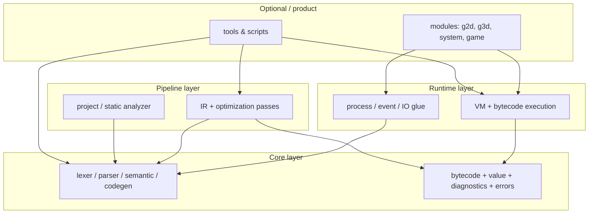

# Kern repository architecture

This document describes how the **Kern language and toolchain** repository is organized today, how that maps to a **production-style layout**, and the **dependency rules** that keep the codebase maintainable as it grows.

Kern is primarily a **C++ compiler + bytecode VM + native module host**, with `.kn` sources for the standard library, plus separate trees for editors, packaging, and optional experiments. It is **not** a single game engine monolith: engine-style ECS and higher-level game runtime live in companion packages (for example **`3dengine/`** when present), not in the core language VM.

---

## Goals

- **Separation of concerns:** compiler front-end, IR/back-end, VM execution, native modules, stdlib, and maintainer tooling are identifiable and navigable.
- **Scalable dependency direction:** lower layers do not depend on higher layers (see below).
- **Discoverability:** contributors find the right directory without reading `CMakeLists.txt` first.
- **Non-breaking evolution:** large physical moves are done in **phases** with green CI after each phase; behavior and CLI contracts stay stable unless explicitly versioned.

---

## Dependency direction (enforced conceptually)

Intended top-down flow:

**Rules:**

1. **`core`** (`kern/core/`) — front-end, bytecode model, diagnostics, errors, platform helpers; no Raylib/SDL; no **`vm/*.hpp`** execution internals.
2. **`pipeline`** (`kern/pipeline/`) — IR builders/passes, analyzer; **depends on core only**; must not **`#include "vm/..."`**.
3. **Runtime** (`kern/runtime/vm/`) — execution and builtins implementation; may include core + (in toolchain binaries) pipeline objects, but VM headers stay execution-focused.
4. **Native modules** (`kern/modules/`) sit above the VM; they may include **`vm/`**, **`bytecode/`**, and **`game/`** (when enabled); **`kern/core/`** and **`kern/pipeline/`** must not **`#include`** module headers.
5. **Maintainer scripts** are not linked into `kern.exe`.

**Tools vs engine:** C++ CLI entrypoints live under **`kern/tools/`** and link the static **`kern_core`** library (compiler + VM + pipeline glue + scanner drivers + builtin module registry). **`kern/core/`**, **`kern/pipeline/`**, and **`kern/runtime/`** do not depend on **`kern/tools/`**. Remaining **`src/`** is **glue only** (import/stdlib, process, system, scanner, packager, compile) — see **`KERN_SRC_GLUE_INCLUDES`**.

---

## Current layout (authoritative for builds)

The **CMake project root** is the repository root. Primary paths:

| Area | Path | Role |
|------|------|------|
| Compiler front-end | `kern/core/compiler/` | Lexer, parser, semantic, codegen |
| Bytecode / value model | `kern/core/bytecode/` | Opcode/value types shared by compiler + VM |
| Diagnostic headers | `kern/core/diagnostics/` | Source spans, traceback limits |
| Errors + VM error contract | `kern/core/errors/` | `ErrorReporter`, `VMErrorCode`, registry metadata |
| Platform helpers | `kern/core/platform/` | `env_compat`, Windows `.kn` association |
| VM execution | `kern/runtime/vm/` | Interpreter, builtins impl, sockets, verifier |
| Pipeline (IR + analysis + backend) | `kern/pipeline/ir/`, `kern/pipeline/analyzer/`, `kern/pipeline/backend/` | Typed IR, passes, analyzer, **C++ backend** (`kernc` / standalone) |
| Shared config / cache | `kern/core/utils/` | **`kernconfig`**, **`build_cache`** (Phase 11) |
| Native modules | `kern/modules/g2d/`, `kern/modules/g3d/`, `kern/modules/system/`, `game/`, `builtin_module_registry.*` | Graphics, input, render, vision, game builtins; **`get_builtin_modules()`** |
| Packaging / batch compile | `src/packager/`, `src/compile/` | Bundle writer, compile pipeline driver (glue) |
| System glue | `src/system/`, `src/process/` | Event bus, process module |
| CLI entrypoints | `kern/tools/` (`main.cpp`, `kernc_main.cpp`, `repl_main.cpp`, `lsp_main.cpp`, `scan_main.cpp`, `version_info.rc.in`) | `kern`, `kernc`, REPL, LSP, `kern-scan` |
| Scanner drivers | `src/scanner/` (`scan_driver`, registry checks) | Shared by `kern` and `kern-scan` |
| Import / stdlib glue | `src/import_resolution.cpp`, `src/stdlib_modules.cpp` | Module loading (still under `src/`) |
| Stdlib (`.kn`) | `lib/kern/` | Standard library sources loaded by the VM |
| Examples | `examples/` | Sample programs (CI smoke paths) |
| Tests | `tests/` | Coverage and regression |
| Docs | `docs/` | Guides and references |
| Maintainer automation | `scripts/` | Release checks, sync, coverage helpers |
| Repo tooling & assets | `tools/` | Windows **`kernc`** launcher C source, release cmd, site scripts, optional local `vcpkg` (gitignored); **not** the C++ CLI tree (`kern/tools/`) |
| Packager | `kern-to-exe/` | `.kn` → standalone executable pipeline |
| Registry | `kern-registry/` | Package registry (Node + static registry) |
| Editors | `Kern-IDE/` | Desktop IDE, VS Code extension (separate product) |
| Document demo | `framework/` | Optional CMake-gated demo |

**Version:** `KERN_VERSION.txt` at repo root (see `README.md`).

---

## Target layout (migration north star)

Physical names mirror **roles**, not historical accident. The table maps **target** directories to **current** locations during migration.

| Target | Current (today) | Contents |
|--------|-----------------|----------|
| `kern/core/` | `compiler/`, `bytecode/`, `diagnostics/`, `errors/`, `platform/` | Language + bytecode + diagnostics + errors + portable helpers |
| `kern/pipeline/` | `ir/`, `analyzer/`, `backend/` | IR + analysis + C++ backend emission |
| `kern/runtime/` | `kern/runtime/vm/`, `src/system/`, `src/process/`, `src/stdlib_modules.cpp` | Execution engine, hosting, stdlib registration |
| `kern/modules/g2d/` + `g3d/` | *landed* under **`kern/modules/`** | 2D/3D Raylib-backed native modules |
| `kern/modules/system/` | *landed* | Input, vision, render host modules |
| `kern/modules/game/` | *landed* | Game builtins + **`kern_game`** entry (`game_main.cpp`) |
| `kern/math/` | *n/a in core repo* | Reserved for shared math helpers if extracted from modules |
| `kern/ecs/` | *n/a in language repo* | ECS belongs in engine packages (e.g. `3dengine/`), not in the VM core |
| `kern/std/` | `lib/kern/` | Standard library `.kn` (and small assets) |
| `kern/tools/` | *landed* — CLI `main` TUs + Windows version template | **`kern`**, **`kernc`**, REPL, LSP, **`kern-scan`** entrypoints |
| `tools/` (repo root) | *stable* | **`kernc_launcher.c`**, release scripts — tiny launchers beside CMake-built binaries |
| *follow-up* | `src/packager/`, `src/compile/` | Bundling / batch compile driver (still **`src/`** glue) |
| `kern/core/utils/` | *landed* | **`kernconfig`**, **`build_cache`** |
| `kern/examples/` | `examples/` | Examples (or symlink/junction during transition) |
| `kern/tests/` | `tests/` | Tests |
| `kern/docs/` | `docs/` | Documentation (or stay at repo root `docs/`; both are acceptable if one is canonical) |

**Note:** The prefix `kern/` here is a **directory name** for the language tree, not the `kern` executable. Adjust if the repo prefers `lang/` or `toolchain/` to avoid confusion.

**ECS:** The user-facing template you may use for **engine** repos is `ecs/` at the product root. For **this** repository, keep ECS **out** of `core` and `runtime`; implement ECS in a separate package that depends on Kern.

---

## CMake and include paths

Executable targets are declared in the root **`CMakeLists.txt`**, which includes **`cmake/kern_paths.cmake`**. Shared engine objects compile into **`kern_core`** (static library). **`KERN_TOOLCHAIN_PRIVATE_INCLUDES`** = **`KERN_CORE_INCLUDES`** (includes **`kern/core/utils/`** as **`utils/...`**) + **`KERN_PIPELINE_INCLUDES`** (includes **`backend/...`**) + **`KERN_MODULES_INCLUDES`** (**`g2d/...`**, **`game/...`**, **`system/...`**) + **`KERN_SRC_GLUE_INCLUDES`** (remaining **`src/`** tree only) + **`KERN_RUNTIME_INCLUDES`** + **`KERN_SHARED_INCLUDES`**. CMake path vars: **`KERN_BACKEND_DIR`**, **`KERN_UTILS_DIR`**, **`KERN_GAME_MODULE_DIR`**. CLI tools link **`kern_core`** for the same include roots. **`KERN_REPO_TOOLS_DIR`** — repo-root **`tools/`** launchers. **Pipeline rule:** IR/analyzer TUs must not include **`vm/*.hpp`** (C++ **`backend/`** may pull VM/toolchain headers as needed for emission).

Further physical moves of `src/*` into `kern/core/` etc. require updating **`CMakeLists.txt`** source lists and, if needed, include roots—then CI and docs paths.

### Glue include surface (`KERN_SRC_GLUE_INCLUDES`)

Still rooted in **`src/`** until a future phase: **`packager/`**, **`compile/`**, **`system/`**, **`process/`**, **`scanner/`**, **`import_resolution.*`**, **`stdlib_modules.*`**, **`tests/`** (under `src/tests/`), etc. **`backend/`**, **`utils/`**, and **`game/`** now live under **`kern/`** (Phase 11).

---

## Phased migration plan

### Phase 0 — Documentation and contracts (complete when merged)

- Add **`docs/architecture.md`** (this file) and **`kern.toml`** path map.
- Link from **`README.md`** so new contributors see the map first.

### Phase 1 — CMake path abstraction (done)

- **`cmake/kern_paths.cmake`** defines `KERN_ROOT_DIR`, `KERN_SRC_DIR`, `KERN_VM_DIR`, `KERN_TOOLCHAIN_PRIVATE_INCLUDES`, `KERN_EXAMPLES_DIR`, **`KERN_TOOLS_DIR`** / **`KERN_CLI_DIR`** (product CLI under **`kern/tools/`**), **`KERN_REPO_TOOLS_DIR`** (repo-root **`tools/`** launchers), and **`KERN_SCRIPTS_DIR`**. Root **`CMakeLists.txt`** includes it; most legacy sources still use `"${KERN_SRC_DIR}/…"`, while the VM slice uses **`${KERN_VM_DIR}/…`**.
- Optional follow-up: split targets into **`cmake/kern_targets.cmake`** without changing paths again.

### Phase 2 — VM slice (done)

- **`kern/runtime/vm/`** — sources via **`KERN_VM_DIR`**.

### Phase 3 — Core layer + compiler (done)

- **`kern/core/compiler/`** — **`KERN_COMPILER_DIR`**; semantic analysis uses **`compiler/builtin_names.hpp`** (no **`vm/builtins.hpp`**).
- **`kern/core/bytecode/`** — value + bytecode + peephole; **`KERN_CORE_BYTECODE_DIR`**; shared by codegen and VM.
- CMake include groups: **`KERN_CORE_INCLUDES`**, **`KERN_RUNTIME_INCLUDES`**, **`KERN_SHARED_INCLUDES`**.

### Phase 4 — Diagnostics + shrink legacy includes (done)

- **`kern/core/diagnostics/`** — **`KERN_DIAGNOSTICS_DIR`**; **`KERN_CORE_INCLUDES`** is **`kern/core/`** only (no **`src/`** for diagnostics).
- Legacy **`src/`** include bucket (today superseded by **`KERN_SRC_GLUE_INCLUDES`** for remaining glue).

### Phase 5 — Errors + platform + VM error contract (done)

- **`kern/core/errors/`** — **`errors.*`**, **`vm_error_codes.hpp`**, **`vm_error_registry.hpp`** (shared diagnostic contract; not VM execution).
- **`kern/core/platform/`** — **`env_compat`**, **`win32_associate_kn.*`**
- **`KERN_ERRORS_DIR`**, **`KERN_PLATFORM_DIR`**; core headers no longer need **`src/`** for these.

### Phase 6 — Pipeline layer: IR + analyzer (done)

- **`kern/pipeline/ir/`**, **`kern/pipeline/analyzer/`** — **`KERN_PIPELINE_DIR`**, **`KERN_PIPELINE_INCLUDES`**; analyzer uses **`compiler/builtin_names.hpp`** (not **`vm/builtins.hpp`**).

### Phase 7 — CLI / tools layer (done)

- **`kern/tools/`** — `main.cpp`, `kernc_main.cpp`, `repl_main.cpp`, `lsp_main.cpp`, `scan_main.cpp`, **`version_info.rc.in`**.
- **`KERN_CLI_DIR`** / **`KERN_TOOLS_DIR`** in **`cmake/kern_paths.cmake`**; **`KERN_REPO_TOOLS_DIR`** for repo-root **`tools/`** ( **`kernc_launcher.c`**, release cmd).
- Static **`kern_core`** library: shared compiler + VM + pipeline + scanner drivers + import/stdlib glue; executables link **`kern_core`**; optional **`kern_gfx`** (Raylib + g2d/g3d + game builtins) links only **`kern`**, **`kernc`**, **`kern_repl`**, **`kern-scan`**, **`kern_game`** (not **`kern_lsp`**).

### Phase 8 — “God file” splits (optional)

- Identify oversized translation units (for example `vm.cpp`, `codegen.cpp`) and split **only** along natural boundaries (one responsibility per file), with no semantic change.

### Phase 9 — Stdlib path

- Migrate **`lib/kern/`** → **`kern/std/`** (or `std/`) and update VM/stdlib resolution + docs + registry checks together.

### Phase 10 — Native modules layer (done)

- **`kern/modules/`** — **`g2d/`**, **`g3d/`**, **`system/`**; **`KERN_MODULES_DIR`**, **`KERN_MODULES_SRC_DIR`**, **`KERN_MODULES_INCLUDES`** in **`cmake/kern_paths.cmake`**.
- **`builtin_module_registry.hpp`** / **`.cpp`** — **`KernBuiltinModule`** + **`get_builtin_modules()`** (placeholder **`init`** hooks; future: dynamic load, C ABI, versioning).
- Includes from module TUs use **`#include "g2d/..."`**, **`#include "system/..."`** ( **`kern/modules/`** on the include path), not **`src/modules/...`**.

### Phase 11 — Final `src/` collapse (done)

- **`kern/modules/game/`** — builtins + **`kern_game`** main (was **`src/game/`**).
- **`kern/pipeline/backend/`** — **`cpp_backend`** (was **`src/backend/`**).
- **`kern/core/utils/`** — **`kernconfig`**, **`build_cache`** (was **`src/utils/`**).
- **`KERN_BACKEND_DIR`**, **`KERN_UTILS_DIR`**, **`KERN_GAME_MODULE_DIR`** in **`cmake/kern_paths.cmake`**; **`KERN_LEGACY_SRC_INCLUDES`** removed in favor of **`KERN_SRC_GLUE_INCLUDES`** (only transitional **`src/`** sources).

### Phase 12 — Eliminate `src/` glue (future)

- Move **`packager/`**, **`compile/`**, **`import_resolution`**, **`stdlib_modules`**, **`process/`**, **`system/`**, **`scanner/`** into **`kern/`**; then **`KERN_SRC_GLUE_INCLUDES`** can be dropped or reduced to empty.

---

## Imports and Kern packages

- **C++:** includes use **`utils/...`** (core), **`backend/...`** (pipeline), **`game/...`** (modules), plus **`src/`**-relative paths only for remaining glue files.
- **`.kn` packages:** project and lock files (`kern.json`, `kern.lock`) remain the **package** manifest; **`kern.toml`** in this repo describes **repository layout** only unless a future tool adopts it.

---

## Related repositories and trees

| Tree | Relationship |
|------|----------------|
| `Kern-IDE/` | Editor products; not required to build `kern` |
| `kern-registry/` | Registry service and package metadata |
| `kern-to-exe/` | Standalone executable packaging |
| `3dengine/` | Optional higher-level engine / ECS experiments; keep dependency one-way: engine → Kern toolchain |

---

## Further improvements (optional)

- **Plugin architecture:** formalize a **narrow C ABI** or stable “native module SDK” header set so third-party modules do not include private compiler headers.
- **Performance:** profile hot paths in `kern/runtime/vm/vm.cpp` and bytecode dispatch; consider computed goto or threaded interpreter where portable.
- **Testing:** add CMake targets per layer (`kern_core_tests`, `kern_vm_tests`) to enforce link boundaries as directories split.

---

## Maintenance

When you add a new top-level directory or move a major subsystem, update:

1. This file’s **Current layout** and **Target layout** tables.
2. **`kern.toml`** `[paths]` if used as a human-readable map.
3. **`README.md` → Project layout** for contributor-facing discovery.
